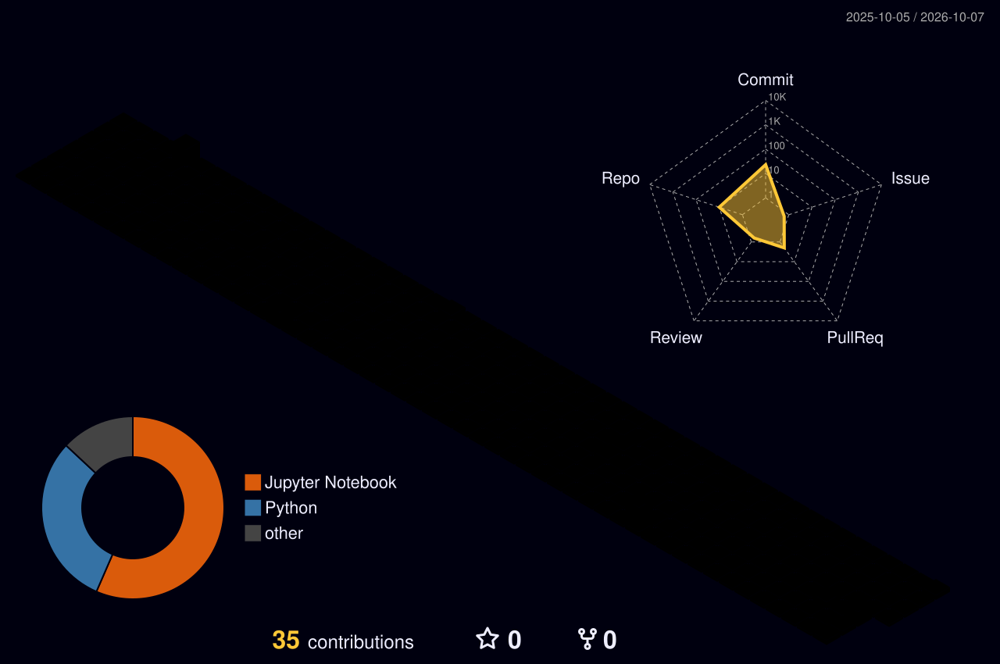

  <!-- Header Banner -->
  

  <!-- Social & Contact Badges -->
  
  
  

---

### 🧠 About Me

I am an **AI & Machine Learning Engineer** specializing in developing scalable predictive systems, GenAI workflows, and containerized ML pipelines. My core focus centers on bridging statistical modeling, LLM orchestration (LangChain), and robust backend engineering with Docker and SQL.

* 🔭 Currently building & scaling: **GenAI agents, LangChain workflows & production ML pipelines**.
* ⚙️ Core Specialties: **End-to-end Machine Learning, LLM integration, Docker containerization, Data engineering**.
* 💬 Ask me about: **Fraud detection architectures, NLP/RAG pipelines, Model deployment, and Python optimization**.
* ⚡ Philosophy: *Turning raw data and stochastic models into deterministic, high-throughput software systems.*

---

### 🛠️ Tech Stack & Tooling

  #### Core Languages & Frameworks
  

   

  #### AI, MLOps & Cloud Tooling
  

 

  <!-- Specialized Tags -->
  
  
  
  
  

---

### 🚀 Featured Projects

#### 🛡️ [Fraud Detection System — Real-Time Predictive ML Pipeline](https://github.com/rosh93an/fraud-detection)
> *A production-grade machine learning system engineered to identify anomalous transactions with low latency and high precision.*

* **Data Engineering & Imbalance Handling**: Processed high-dimensional financial transaction logs; tackled extreme class imbalance using SMOTE, threshold tuning, and cost-sensitive loss functions.
* **Model Pipeline**: Benchmarked XGBoost, LightGBM, and Random Forest models, optimizing ROC-AUC and PR-AUC scores to minimize false positives.
* **Serving & Deployment**: Packaged the inference pipeline inside a multi-stage **Docker** container for reproducible model serving.
* **Tech Stack**: `Python`, `Scikit-Learn`, `XGBoost`, `FastAPI`, `Docker`, `SQL`, `Pandas/NumPy`.

---

#### ⚡ [AI-Powered Enterprise Email Automation Engine](https://github.com/rosh93an/AI-POWERED-EMAIL-AUTOMATION)
> *An automated orchestration architecture designed to classify, extract intent, and route high-volume incoming organizational emails.*

* **NLP & Intent Extraction**: Implemented LLM-driven pipelines to classify intent, extract key entities (dates, IDs, urgency), and generate structured JSON outputs.
* **Workflow Automation**: Built modular routing logic connecting inbox triggers with automated processing logic.
* **Extensible Architecture**: Clean abstraction layer enabling seamless swapping between open-source LLMs and proprietary APIs with zero code breakages.
* **Tech Stack**: `Python`, `LangChain`, `NLP / LLMs`, `SQL`, `AsyncIO`.

---

### 📊 GitHub Activity & Statistics

  <!-- 3D Contribution Calendar (Auto-generated by GitHub Actions) -->
  

 

  <!-- GitHub Stats Card -->
  
  
  <!-- Top Languages Card -->
  

 

  <!-- Streak Stats Card -->
  

---

  ⚡ Crafted with passion for Machine Learning & Open Source Software by <a href="https://github.com/rosh93an">@rosh93an</a>

